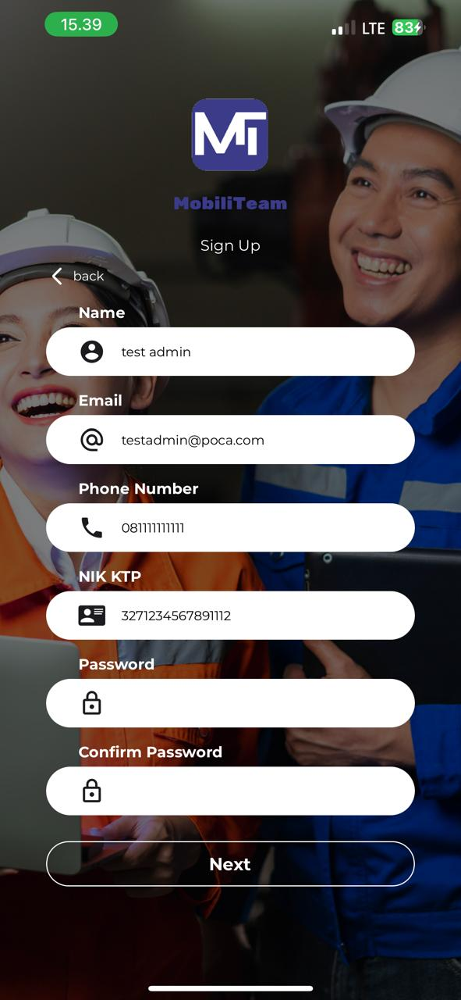
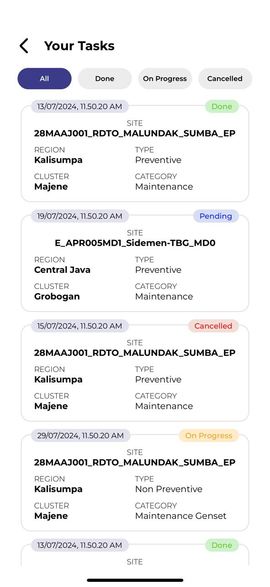
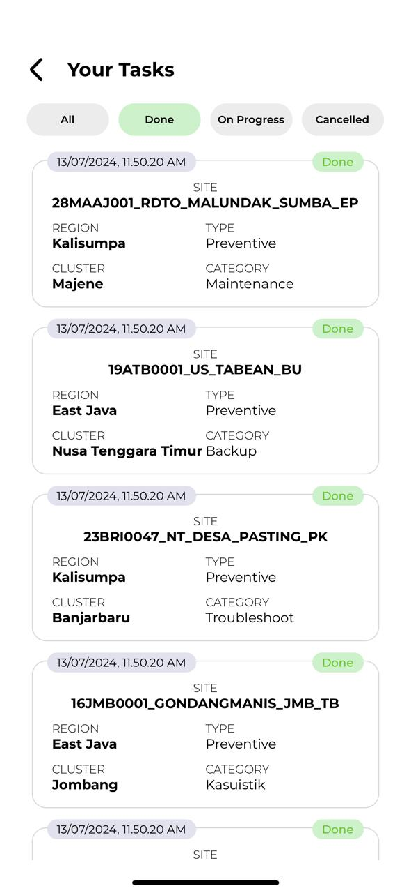
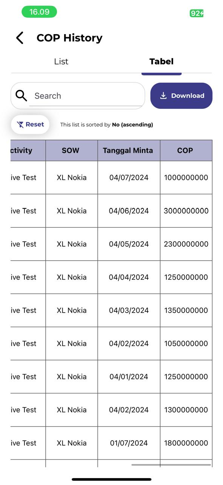
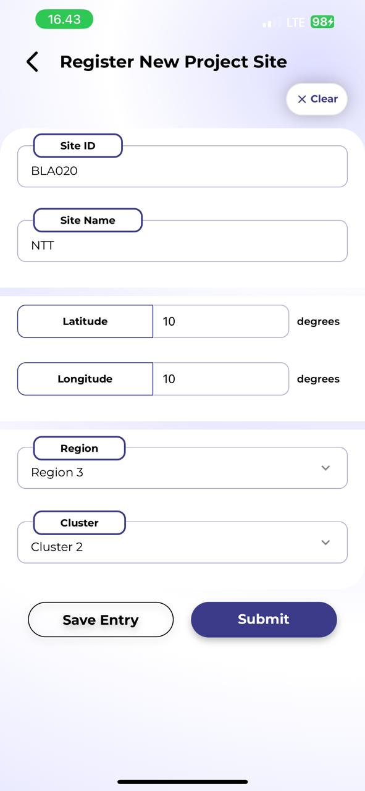

# UI Revamp and Development Project for **MobiliTeam** App 🧑‍💻🧑‍🔧📱

Disusun oleh tim Kerja Praktik ITB STI 2024

- Angela Geraldine
- Esther Regina

## Penjelasan Singkat Aplikasi

MobiliTeam adalah aplikasi seluler untuk melakukan monitoring pekerjaan dan manajemen tim lapangan. _Repository_ ini berisi kode untuk membangun prototipe aplikasi MobiliTeam dengan tampilan antarmuka yang telah diperbarui. Prototipe ini tidak mengandung informasi sensitif dan seluruh data yang ditampilkan merupakan _placeholder_.

## Cara menjalankan aplikasi

1. Buka project pada Visual Studio Code dan ubah directory terminal ke directory project.
2. Pada terminal, jalankan command `npm install` untuk menginstal semua modul dan _dependencies_ yang diperlukan untuk menjalankan aplikasi.

Selanjutnya, aplikasi dapat dijalankan melalui Expo Go maupun emulator Android Studio.

### Cara menjalankan aplikasi pada Expo Go

Expo Go adalah platform _sandbox_ untuk menjalankan aplikasi _native_ Expo sehingga pengujian aplikasi dapat dilakukan dengan lebih cepat. Penjalanan aplikasi melalui Expo Go bersifat terbatas karena terdapat beberapa _package_ dan _module_ yang hanya bisa dijalankan pada _development build_ saja.

Aplikasi Expo Go dapat diunduh pada [Google Play Store](https://play.google.com/store/apps/details?id=host.exp.exponent&referrer=docs) maupun [App Store](https://itunes.apple.com/app/apple-store/id982107779).

1. Jalankan command `npm start` untuk mengaktifkan _development server_ yang dapat diakses oleh Expo Go.
2. Pada terminal, apabila aplikasi dijalankan pada _development build_, ketik "s" untuk beralih ke Expo Go.
3. _Scan_ kode QR yang tersedia pada terminal.
4. Setelah _scan_ kode QR berhasil, pilih Expo Go untuk membuka Expo Go yang akan menjalankan aplikasi MobiliTeam.

### Cara menjalankan aplikasi pada Emulator Android Studio

Android Studio adalah platform lingkungan pengembangan untuk membangun aplikasi Android. Android Studio dilengkapi dengan **emulator** yang dibutuhkan untuk menjalankan _development build_ aplikasi.

Untuk mengunduh dan menggunakan emulator dari Android Studio, silahkan merujuk kepada dokumentasi Expo Dev pada tahapan [Set Up Android Studio](https://docs.expo.dev/get-started/set-up-your-environment/?platform=android&device=simulated&mode=development-build&buildEnv=local#set-up-android-studio) dan [Set up an emulator](https://docs.expo.dev/get-started/set-up-your-environment/?platform=android&device=simulated&mode=development-build&buildEnv=local#set-up-an-emulator).

1. Jalankan command `npm run android` untuk melakukan _build_ aplikasi.
2. Setelah menjalankan seluruh tahapan, emulator akan otomatis terbuka dan aplikasi otomatis dijalankan.

## Layar Prototipe MobiliTeam

**1. Melakukan Log In**  

**2. Melakukan Sign Up**  

**3. Menambahkan task baru**  

**4. Melihat daftar task**  

**5. Menambahkan permintaan BBM**  

**6. Melihat data BBM**  

**7. Menambahkan data COP**  

**8. Melihat data COP**  

**9. Menambahkan data AOR**  

**9. Menambahkan data AOR**  

**10. Melihat data AOR**  

**11. Menambahkan data tower**  

**12. Melihat data tower**  

**13. Melakukan clock in**  

**14. Melakukan clock out**  

